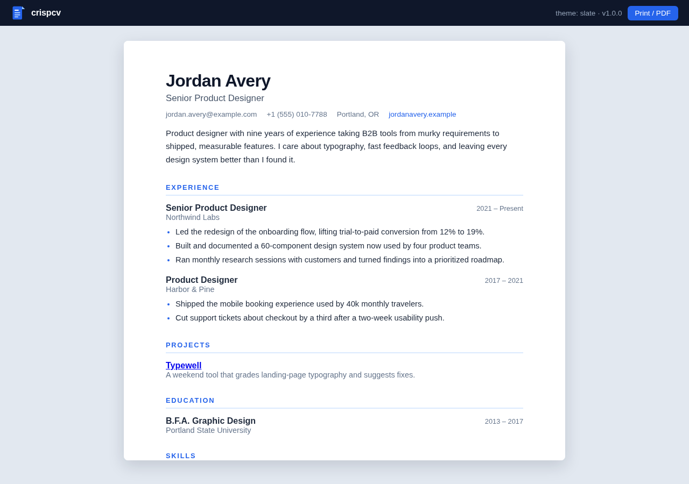

# crispcv

**Turn one TOML file into a polished, print-ready resume.**

No accounts, no templates marketplace, no drag-and-drop editor fighting you over
margins. You keep your resume as a small, version-controllable text file, and
crispcv renders it into clean, ATS-friendly HTML you can print straight to PDF
from any browser.



## Who it's for

- Developers and designers who want their resume in git, not in a web app
- Anyone maintaining multiple resume variants (one file per role, same tool)
- People who just want a good-looking resume in five minutes without a signup

## Quick start

Requires Python 3.11+ (or 3.10 with `pip install tomli`). No other dependencies.

```bash
python3 -m crispcv init            # writes a starter resume.toml
python3 -m crispcv build resume.toml
```

Open `resume.html` in a browser and print to PDF. Done.

## Commands

```bash
python3 -m crispcv init [path]                 # scaffold a starter resume.toml
python3 -m crispcv build resume.toml -t ivory  # render to resume.html
python3 -m crispcv preview resume.toml         # render with a toolbar + print button
python3 -m crispcv themes                      # list built-in themes
```

## Themes

| Theme  | Feel |
|--------|------|
| `slate` | Modern sans-serif with blue accents (default) |
| `ivory` | Classic serif on warm paper — traditional industries |
| `mono`  | Monospace minimalism — engineers will feel at home |

## The file format

Everything lives in one TOML file: `[basics]` for name, title, contact and
summary; `[[work]]`, `[[education]]` and `[[projects]]` entries with optional
`highlights` lists; and `[skills]` groups. See `resume.example.toml` for a
complete, realistic example.

## Features

- Single-file HTML output — self-contained, no external assets
- Print stylesheet tuned for PDF export (sections never split across pages)
- All content HTML-escaped; your `<angle brackets>` won't break the layout
- Empty sections are simply omitted — no placeholder clutter
- Responsive: the same file reads well on a phone
- Zero runtime dependencies on Python 3.11+

## Development

```bash
python3 -m unittest discover -s tests
```

Fourteen tests cover validation, escaping, themes, and the CLI.
